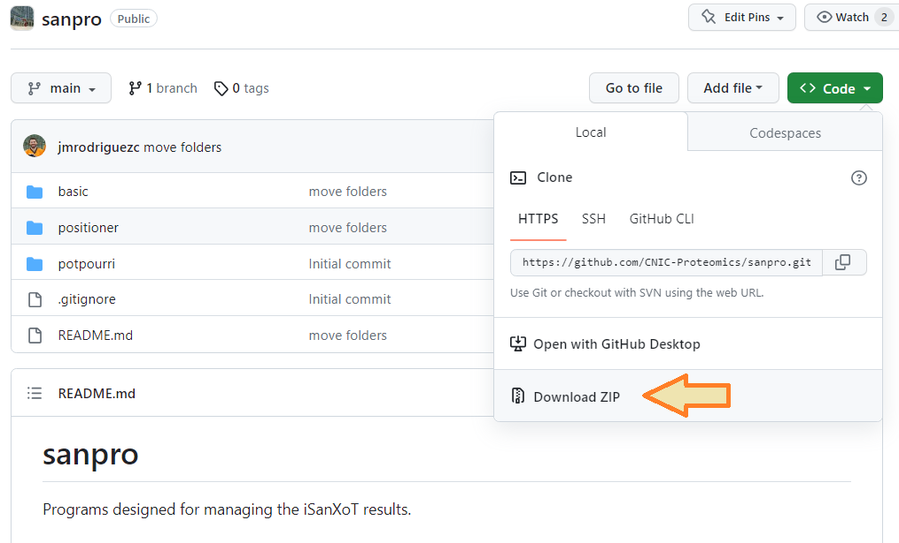

# SANPRO

Programs designed for managing the iSanXoT results.


# File structure
```
|
├── basic
│   ├── diff_tables.py
│   ├── filter_table.py
│   ├── sort_table.py
│   ├── get_n_rows.py
├── positioner
│   ├── add_pep_position.py
├── potpurri
│   ├── convert_bed_to_fasta.py
├── README.md
└── .gitignore
```

**tests** folder contains test files. Note: This folder may not exist.

**potpourri** is a folder for discarding. It is a mixture of programs without an objective.


# Installation

## Download the repository

Download the SANPRO programs from the GitHub repository located at 
<br/><a href='https://github.com/CNIC-Proteomics/SANPRO'>https://github.com/CNIC-Proteomics/SANPRO</a>.



Next, decompress the zip file.

<!--
## Can I run a Python script without typing "python" before the script name?

On Unix-based systems, you can add a shebang (#!/usr/bin/env python3) at the top of your script and make the script executable using the **chmod +x script.py** command.

On Windows, you can associate the .py extension with the Python interpreter.

Then, include the path of scripts into PATH environment variable.

On Unix-based systems:
```
export PATH=${PATH}:/U_Proteomica/UNIDAD/SANPRO/basic
```

On Windows:
```
SETX PATH "%PATH%;S:\U_Proteomica\UNIDAD\SANPRO\basic"
```

Retrieve the environment variables
```
SET
```
-->

## Prerequisities

You need to install the Python programming language and the following packages. To install these packages, you can use the pip module in Python:

```
pip install pandas
pip install numpy
pip install logging
pip install re
pip install argparse
pip install configparser
```

# Programs

## basic: programs for handling large files

* get_n_rows: Retrieve the N rows from the given file.

Usage:
```
python basic/get_n_rows.py -c conf/config.ini
```

* diff_tables: Retrieve the rows that differ based on specified columns from two tabular-separated files.

Usage:
```
python basic/diff_tables.py -c conf/config.ini
```

* filter_table: Filter the given table file based on the provided conditions (header, operator, value).

Usage:
```
python basic/filter_table.py -c conf/config.ini
```

* sort_table: Sort the table file (in tabular-separated format) based on the specified columns.

Usage:
```
python basic/sort_table.py -c conf/config.ini
```

* remove_cols: Remove the specified columns from the table.

Usage:
```
python basic/remove_cols.py -c conf/config.ini
```

* select_cols: Select the specified columns from the table.

Usage:
```
python basic/select_cols.py -c conf/config.ini
```


## positioner: programs that add positions

* add_pep_position: Include the peptide position within the protein in the report.

Usage:
```
python positioner/add_pep_position.py -i tests/test4/Npep2prot.tsv  -f tests/test4/mouse_202206_uni-sw-tr.target.fasta  -hp "peptide"  -hq "protein" -o tests/test4/Npep2prot.new.tsv

python positioner/add_pep_position.py -i tests/test6/LIMMA_Quanprot_Quanpep_Normpep_Nscanpep.tsv  -f tests/test6/rabbit_202306_pro-sw-tr.target.fasta  -hp "peptide"  -hq "protein" -o tests/test6/LIMMA_Quanprot_Quanpep_Normpep_Nscanpep.new.tsv
```

* get_appris: Retrieve APPRIS annotations for the given protein and positions

Usage:
```
python positioner/get_appris.py  -i tests/test7/Paths_PDMTableMaker_PDMTable_GM_2.txt  -c "q,b,e"  -d tests/test7/human_202306.appris.gtf -o tests/test7/appris_annots.gtf
```


## potpourri: programs that possess multiple applications without a specific general focus


